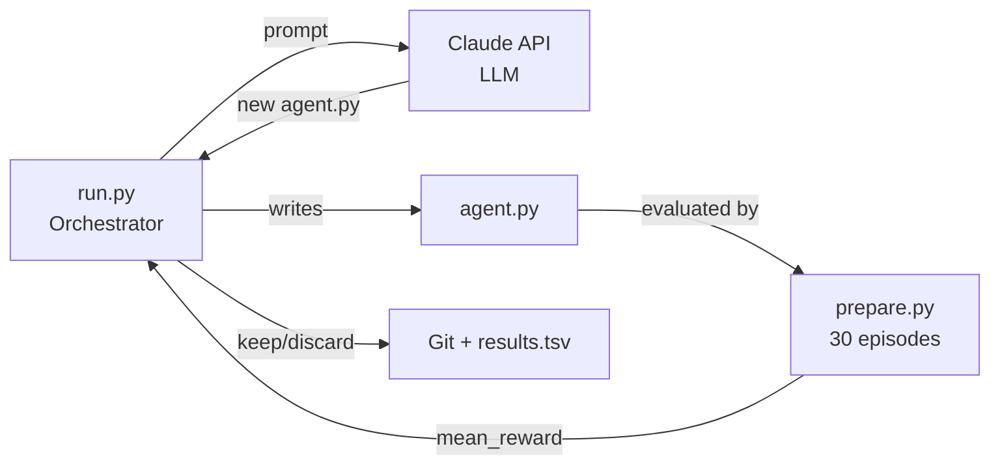
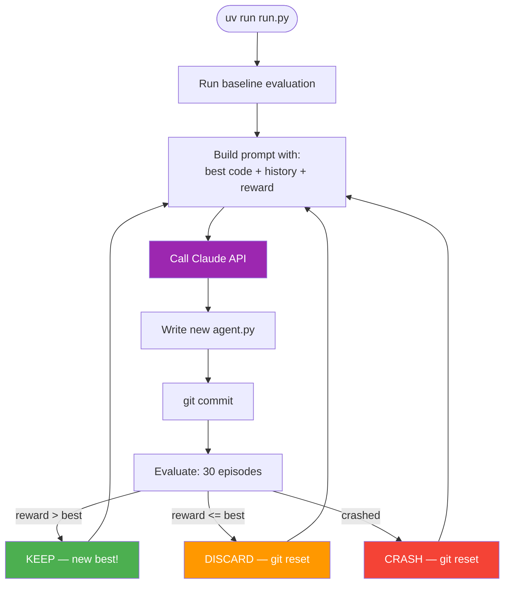
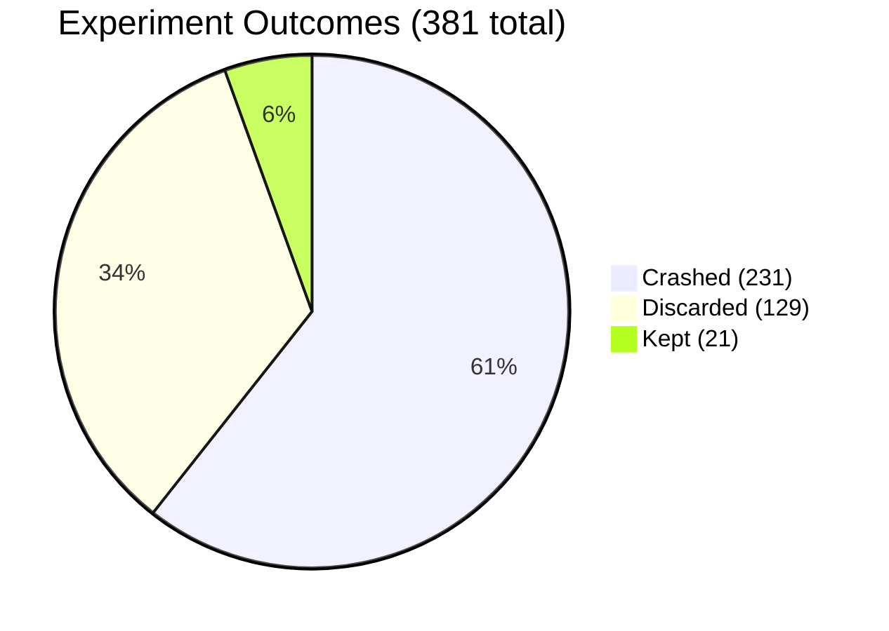
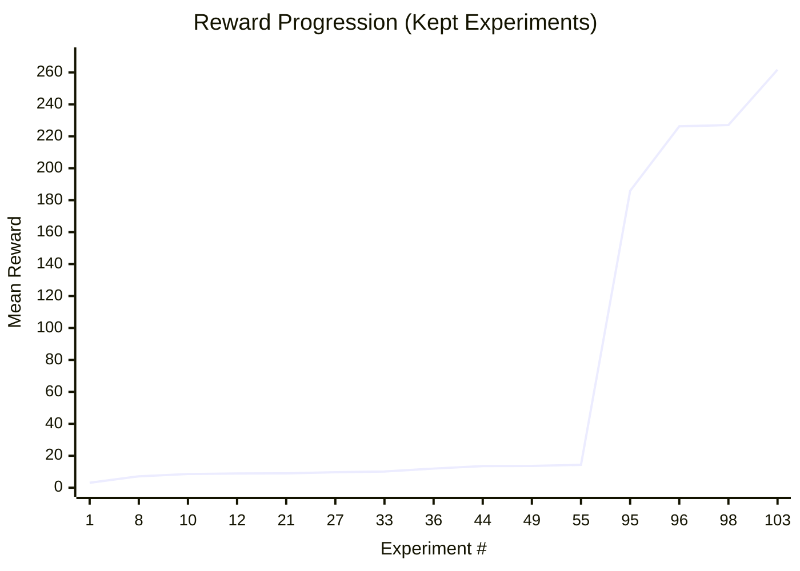
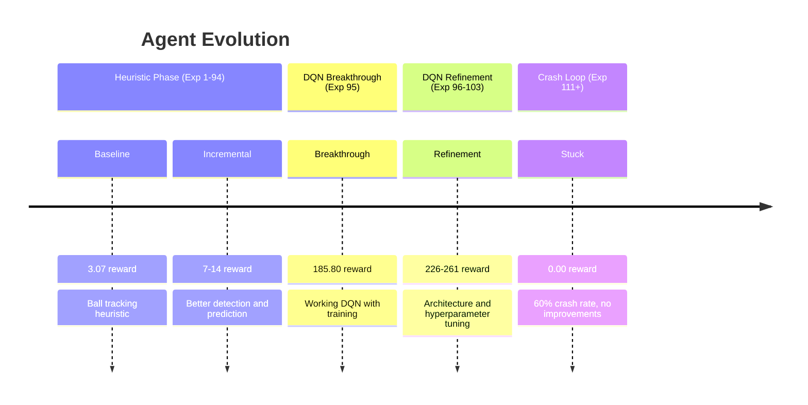
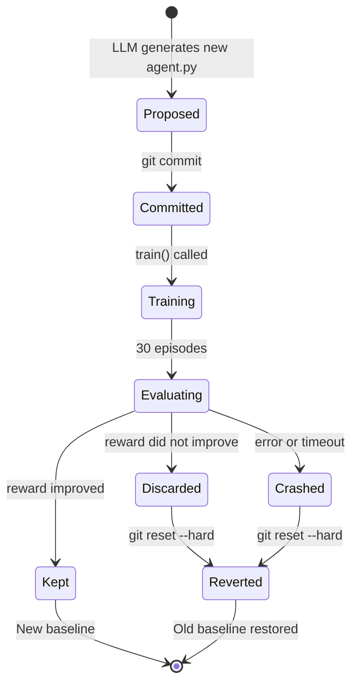
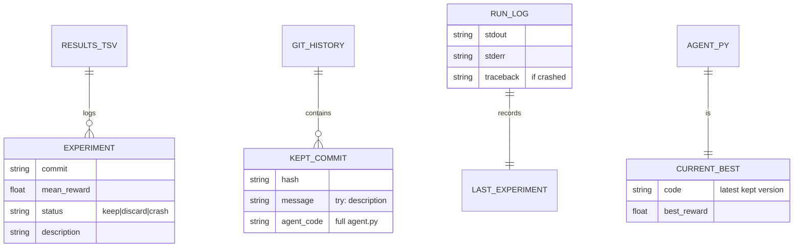
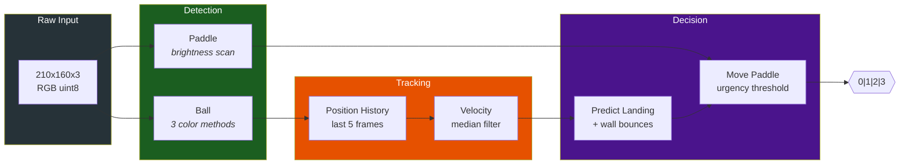
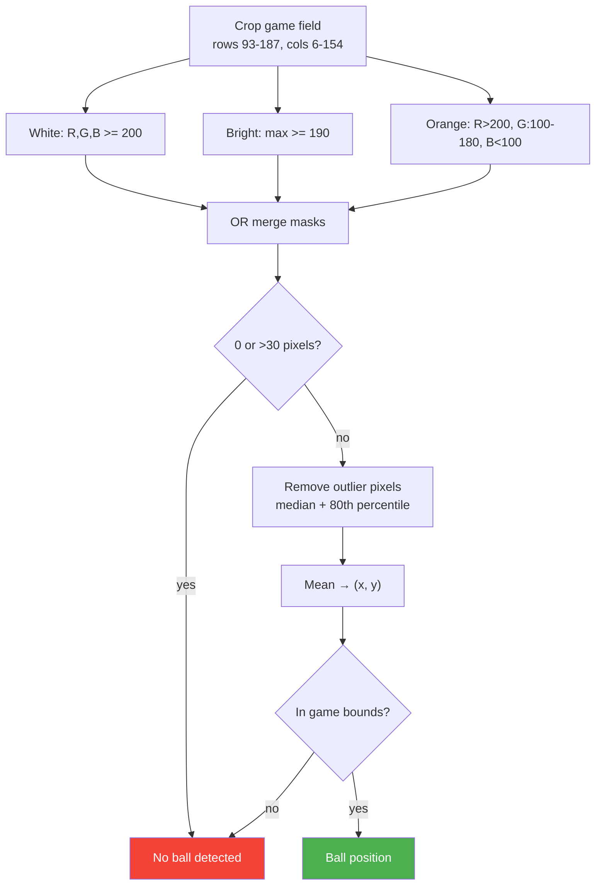

# Atari AutoResearch

> Autonomous AI agent optimization for Atari Breakout — an LLM iteratively modifies the agent code, evaluates it, and keeps only improvements.

See also: [Full Architecture Guide with 20 diagrams](../ARCHITECTURE.md)

---

## How It Works



### The Loop



---

## Quick Start

```bash
cd atari
uv sync
uv run prepare.py                    # verify environment
uv run run.py --api-key <KEY>        # start autonomous loop
```

---

## What a Run Produces

### Output Files

| File | Description | Persists across runs? |
|------|-------------|-----------------------|
| `results.tsv` | Every experiment: commit, reward, status (keep/discard/crash), description | Yes, appends |
| `run.log` | stdout+stderr of the **last** evaluation only | Overwritten each experiment |
| `agent.py` | The current best agent code (evolves over time) | Yes, via git |
| Git history | Each "keep" is a surviving commit on the research branch | Yes |

### results.tsv Format

```
commit    mean_reward    status    description
c45a82e   3.0667         keep      baseline heuristic
2ac7fda   7.1333         keep      improved ball tracking
fdd8bfc   3.0667         discard   worse architecture
8459ed1   0.0000         crash     syntax error
```

### Console Output During a Run

```
============================================================
  EXPERIMENT 42
  Best so far: 13.6000 | Kept: 8 | Discarded: 25
============================================================
[llm] Asking for modification...
[eval] Running: dueling DQN with prioritized replay
[eval] IMPROVED: 13.6000 -> 14.3333 (+0.7333)
```

### What Does NOT Exist (yet)

- **No videos** — the environment runs with `render_mode=None` for speed. See [Recording Videos](#recording-videos) below.
- **No cross-run charts** — `results.tsv` is raw data. See [Analyzing Results](#analyzing-results) below.
- **No checkpoints** — only the final `agent.py` survives; intermediate model weights are not saved.

---

## Understanding Your Run

### Experiment Outcomes



### Reward Progression

The `results.tsv` tracks every experiment. Kept experiments form a monotonically increasing sequence:



### The Breakthrough

Something remarkable happened at experiment #95 — reward jumped from **14.33 to 185.80** (a **13x jump**). This was likely the transition from a heuristic-based agent to a working DQN that actually learned during the training phase.



---

## Recording Videos

The evaluation harness runs headless for speed. To record a video of your agent playing:

```python
# record_video.py — save this in the atari/ directory
import gymnasium as gym
from gymnasium.wrappers import RecordVideo
from prepare import GAME, SEED
from agent import Agent

env = gym.make(GAME, render_mode="rgb_array", frameskip=1)
env = RecordVideo(env, video_folder="./videos", episode_trigger=lambda e: True)

agent = Agent(env.action_space)
obs, info = env.reset(seed=SEED)
agent.reset()

done = False
total_reward = 0
while not done:
    action = agent.act(obs)
    obs, reward, terminated, truncated, info = env.step(action)
    total_reward += reward
    done = terminated or truncated

env.close()
print(f"Reward: {total_reward}, video saved to ./videos/")
```

```bash
uv run record_video.py
```

This will create `.mp4` files in `atari/videos/`.

---

## Analyzing Results

Parse `results.tsv` to visualize your run:

```python
# analyze.py — save this in the atari/ directory
import csv
import matplotlib.pyplot as plt

experiments = []
with open("results.tsv") as f:
    for row in csv.DictReader(f, delimiter="\t"):
        experiments.append({
            "reward": float(row["mean_reward"]),
            "status": row["status"],
        })

fig, axes = plt.subplots(2, 2, figsize=(14, 10))
fig.suptitle("AutoResearch Overnight Run Analysis", fontsize=14, fontweight="bold")

# 1. All rewards over time
ax = axes[0][0]
colors = {"keep": "#4CAF50", "discard": "#FF9800", "crash": "#f44336"}
for i, exp in enumerate(experiments):
    ax.scatter(i, exp["reward"], c=colors[exp["status"]], s=10, alpha=0.7)
ax.set_title("All Experiments")
ax.set_xlabel("Experiment #")
ax.set_ylabel("Mean Reward")

# 2. Kept experiments (reward progression)
ax = axes[0][1]
kept = [(i, e["reward"]) for i, e in enumerate(experiments) if e["status"] == "keep"]
ax.plot([k[0] for k in kept], [k[1] for k in kept], "g-o", markersize=4)
ax.set_title("Kept Experiments (Monotonic Improvement)")
ax.set_xlabel("Experiment #")
ax.set_ylabel("Mean Reward")

# 3. Status distribution
ax = axes[1][0]
counts = {"keep": 0, "discard": 0, "crash": 0}
for e in experiments:
    counts[e["status"]] += 1
ax.bar(counts.keys(), counts.values(), color=[colors[s] for s in counts])
ax.set_title("Outcome Distribution")

# 4. Crash rate over time (rolling window)
ax = axes[1][1]
window = 20
crash_rate = []
for i in range(window, len(experiments)):
    batch = experiments[i-window:i]
    rate = sum(1 for e in batch if e["status"] == "crash") / window
    crash_rate.append(rate)
ax.plot(range(window, len(experiments)), crash_rate, "r-", alpha=0.7)
ax.set_title(f"Crash Rate (rolling {window}-experiment window)")
ax.set_xlabel("Experiment #")
ax.set_ylabel("Crash Rate")
ax.set_ylim(0, 1)

plt.tight_layout()
plt.savefig("run_analysis.png", dpi=150)
print("Saved run_analysis.png")
plt.show()
```

```bash
uv run analyze.py
```

---

## Experiment Lifecycle Details

### What Happens to Each Experiment



### Where Data Lives



---

## Architecture Deep Dive

### Agent Observation Pipeline



### Ball Detection (3 Parallel Methods)



---

## Files Reference

| File | Role | Modified by |
|------|------|-------------|
| `prepare.py` | Environment factory + evaluation harness (30 episodes, fixed seed) | Nobody (frozen) |
| `agent.py` | The agent: `act(obs) → action`, `reset()`, `train()` | LLM via run.py |
| `run.py` | Autonomous orchestrator: LLM calls, git ops, result logging | Nobody (frozen) |
| `program.md` | Instructions that guide the LLM researcher | Human |
| `results.tsv` | Append-only experiment log | run.py |
| `run.log` | Last experiment's stdout/stderr | run.py (overwritten each time) |
