# Atari AutoResearch

> Autonomous AI agent optimization for Atari Breakout — an LLM iteratively modifies the agent code, evaluates it, and keeps only improvements.

---

## Quick Start

### Prerequisites

- Python 3.9-3.12
- [uv](https://docs.astral.sh/uv/) package manager
- An API key for Claude (via Anthropic or Scale litellm proxy)

### Setup

```bash
cd atari
uv sync                              # creates .venv + installs all dependencies
uv run prepare.py                    # verify environment works (quick sanity check)
```

### Run Overnight

```bash
# Default: uses ANTHROPIC_AUTH_TOKEN env var + Scale litellm proxy
uv run run.py --tag apr05

# With explicit API key
uv run run.py --api-key <YOUR_KEY> --tag apr05

# Direct Anthropic API (no proxy)
uv run run.py --api-key sk-ant-... --api-base https://api.anthropic.com --tag apr05

# Limit number of experiments
uv run run.py --tag apr05 --max-experiments 10

# Custom model
uv run run.py --tag apr05 --model anthropic/claude-opus-4-6
```

The `--tag` creates a git branch like `atari-research/apr05` to isolate this run's commits.

### After the Run

```bash
# Generate a 6-panel analysis chart
uv run analyze.py

# View the chart
open run_analysis.png

# Watch the gameplay videos (one per kept experiment)
ls videos/

# Check the raw results log
cat results.tsv
```

---

## How It Works

1. **Baseline** — evaluate the current `agent.py` as-is
2. **Loop** (runs forever until Ctrl+C or `--max-experiments`):
   - Read experiment history from `results.tsv`
   - Ask Claude to modify `agent.py` (with full history context)
   - Write the new code, `git commit`
   - Run the agent: `train()` for up to **1 hour**, then 30 evaluation episodes
   - If `mean_reward` improved: **keep** (new baseline) + record gameplay video
   - If not: **discard** (`git reset --hard` to previous)
   - If crashed: **log crash** + rollback

---

## Timing

Each experiment takes approximately **65-75 minutes**:

| Phase | Time |
|-------|------|
| LLM API call | ~5-30s |
| `train()` | **up to 3600s (1 hour)** |
| 30 evaluation episodes | ~1-5 min |
| Video recording (if kept) | ~10-30s |
| Git + logging | ~2s |

Overnight (12 hours) expect **~10-11 experiments**.

---

## What a Run Produces

| File | Description | Persists? |
|------|-------------|-----------|
| `results.tsv` | Every experiment: commit, reward, status, description | Appends across runs |
| `run.log` | stdout+stderr of the **last** evaluation only | Overwritten each experiment |
| `agent.py` | The current best agent code (on the research branch) | Via git |
| `videos/` | `.mp4` gameplay recordings of each **kept** experiment | Accumulates |
| Git history | Each "keep" is a surviving commit on the research branch | Yes |

### When Does an Experiment End?

An experiment ends when **any** of these conditions is met:

1. **Evaluation completes normally** — `agent.py` runs `train()` (up to 3600s / 1 hour), then plays 30 episodes (up to 10,000 steps each). The process exits, `mean_reward` is parsed from stdout.
2. **The subprocess crashes** — any Python error (syntax, runtime, OOM). Non-zero exit code -> logged as "crash".
3. **Timeout (75 minutes)** — if the subprocess hasn't exited after 4500s, it's killed. Logged as "crash".

The **entire loop** (`run.py`) runs forever unless:
- `--max-experiments N` is set and reached
- You kill the process (Ctrl+C)
- All LLM retries are permanently exhausted (unlikely)

### Console Output

```
============================================================
  EXPERIMENT 42
  Best so far: 13.6000 | Kept: 8 | Discarded: 25
============================================================
[llm] Asking for modification...
[eval] Running: dueling DQN with prioritized replay
[eval] IMPROVED: 13.6000 -> 14.3333 (+0.7333)
[video] Recording gameplay...
[video] Saved to videos/exp0042_reward14*.mp4
```

---

## CLI Reference

```
uv run run.py [OPTIONS]

Options:
  --api-key KEY          API key (or set ANTHROPIC_AUTH_TOKEN env var)
  --model MODEL          LiteLLM model name (default: anthropic/claude-sonnet-4-20250514)
  --api-base URL         API base URL (default: Scale litellm proxy)
  --tag TAG              Branch tag (default: today's date, e.g. apr05)
  --max-experiments N    Max experiments to run (0 = unlimited, default)
  --no-git               Skip git operations (useful for testing)
```

---

## Videos

Every time an experiment **improves** the best reward, a gameplay video is automatically recorded to `atari/videos/`. Videos are named like:

```
videos/exp0000_reward3-episode-0.mp4      # baseline
videos/exp0005_reward7-episode-0.mp4      # first improvement
videos/exp0008_reward186-episode-0.mp4    # DQN breakthrough
```

To manually record a video of the current agent:

```python
import gymnasium as gym
from gymnasium.wrappers import RecordVideo
from prepare import GAME, SEED
from agent import Agent

env = gym.make(GAME, render_mode="rgb_array", frameskip=1)
env = RecordVideo(env, video_folder="./videos", episode_trigger=lambda e: True)
agent = Agent(env.action_space)
obs, _ = env.reset(seed=SEED)
agent.reset()
done = False
while not done:
    action = agent.act(obs)
    obs, reward, terminated, truncated, _ = env.step(action)
    done = terminated or truncated
env.close()
```

---

## Analyzing Results

Run the built-in analyzer:

```bash
uv run analyze.py              # generates run_analysis.png + prints summary
uv run analyze.py --no-show    # save PNG only, don't open window
```

This produces a 6-panel chart:
1. All experiments scatter (color-coded by keep/discard/crash)
2. Reward progression (kept experiments only, monotonic)
3. Outcome distribution (bar chart with percentages)
4. Crash rate over time (rolling window)
5. Reward distribution histogram (non-crash experiments)
6. Cumulative best reward

### results.tsv Format

```
commit    mean_reward    status    description
c45a82e   3.0667         keep      baseline heuristic
2ac7fda   7.1333         keep      improved ball tracking
fdd8bfc   3.0667         discard   worse architecture
8459ed1   0.0000         crash     syntax error
```

---

## Files Reference

| File | Role | Modified by |
|------|------|-------------|
| `prepare.py` | Environment factory + evaluation harness (30 episodes, fixed seed, 1hr budget) | Nobody (frozen) |
| `agent.py` | The agent: `act(obs) -> action`, `reset()`, `train()` | LLM via run.py |
| `run.py` | Autonomous orchestrator: LLM calls, git ops, result logging, video recording | Nobody (frozen) |
| `program.md` | Instructions that guide the LLM researcher | Human |
| `analyze.py` | Results visualization: generates 6-panel chart from results.tsv | Nobody (utility) |
| `results.tsv` | Append-only experiment log | run.py |
| `run.log` | Last experiment's stdout/stderr | run.py (overwritten) |
| `videos/` | Gameplay recordings of kept experiments | run.py |

---

---

# Architecture & System Design

> A visual deep-dive into how the autonomous AI research platform works — from high-level orchestration down to individual components.

```
    LLM proposes change  ──►  System evaluates  ──►  Only improvements survive
         ▲                                                      │
         └──────────────── History fed back ◄───────────────────┘
```

---

## Diagram Index

| # | Section | Diagram Types |
|---|---------|---------------|
| 1 | [System Context](#1-system-context) | C4 Context |
| 2 | [Project Anatomy](#2-project-anatomy) | Mindmap |
| 3 | [The Experiment Loop](#3-the-experiment-loop) | Flowchart |
| 4 | [Single Experiment Lifecycle](#4-single-experiment-lifecycle) | Sequence |
| 5 | [Experiment State Machine](#5-experiment-state-machine) | State Diagram |
| 6 | [Developer Journey](#6-developer-journey) | Journey Map |
| 7 | [Agent Class Design](#7-agent-class-design) | Class Diagram |
| 8 | [Observation Pipeline](#8-observation-pipeline) | Data Flow |
| 9 | [Ball Detection Algorithm](#9-ball-detection-algorithm) | Decision Flowchart |
| 10 | [Trajectory Prediction](#10-trajectory-prediction) | Flowchart |
| 11 | [Evaluation Harness](#11-evaluation-harness) | Flowchart |
| 12 | [LLM Prompt Protocol](#12-llm-prompt-protocol) | Block Diagram |
| 13 | [Git Branching Strategy](#13-git-branching-strategy) | Git Graph |
| 14 | [Experiment Timeline](#14-experiment-timeline) | Gantt |
| 15 | [Data Model](#15-data-model) | ER Diagram |
| 16 | [Action Space](#16-action-space) | Pie + Block |
| 17 | [Error Handling & Recovery](#17-error-handling--recovery) | Flowchart |
| 18 | [Dual-Track Comparison](#18-dual-track-comparison) | Side-by-Side |
| 19 | [Dependency Graph](#19-dependency-graph) | Flowchart |
| 20 | [Outcome Space](#20-outcome-space) | Quadrant Chart |

**Color Legend** used consistently across all diagrams:

| Color | Meaning |
|-------|---------|
| Green | Success / kept / start |
| Red | Failure / crash / error |
| Orange | Warning / discard |
| Purple | LLM / AI interaction |
| Blue | Internal components |
| Dark | External services |

---

## 1. System Context

The 10-second overview. AutoResearch sits between an LLM and a game environment, orchestrating autonomous experiments.

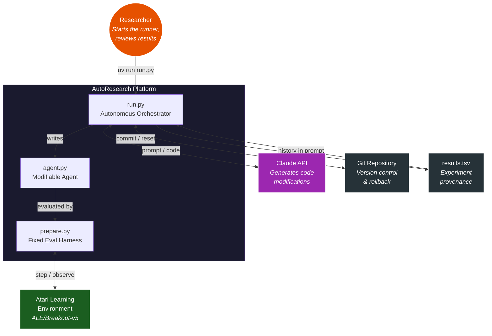

---

## 2. Project Anatomy

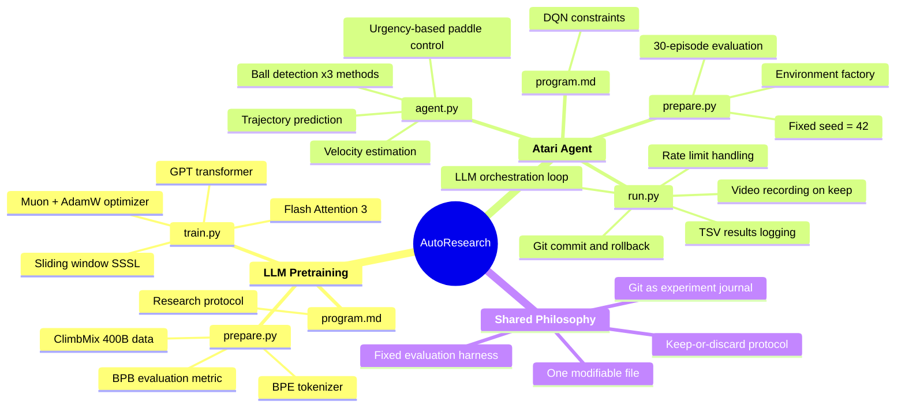

---

## 3. The Experiment Loop

The core algorithm. Every autonomous experiment follows this exact path.

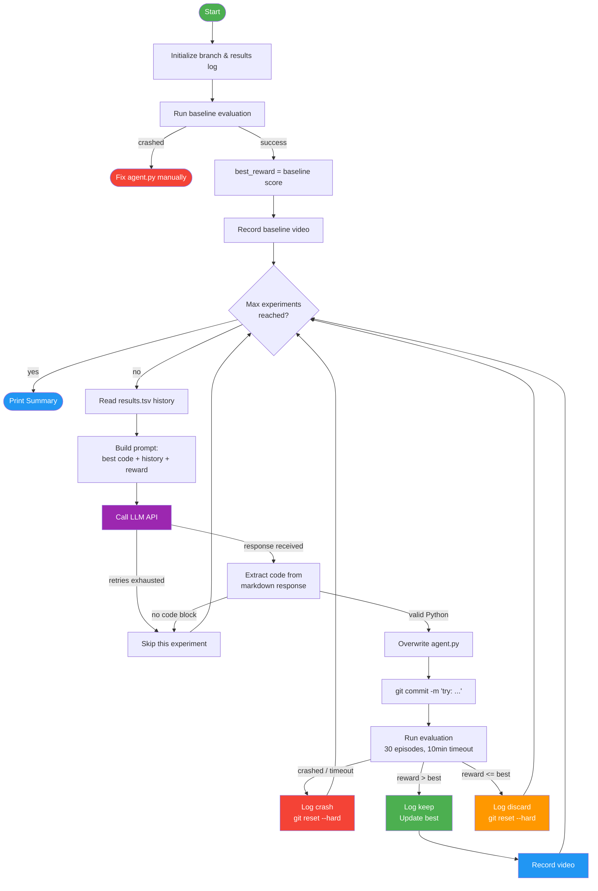

---

## 4. Single Experiment Lifecycle

Every interaction between components during one experiment, from prompt to decision.

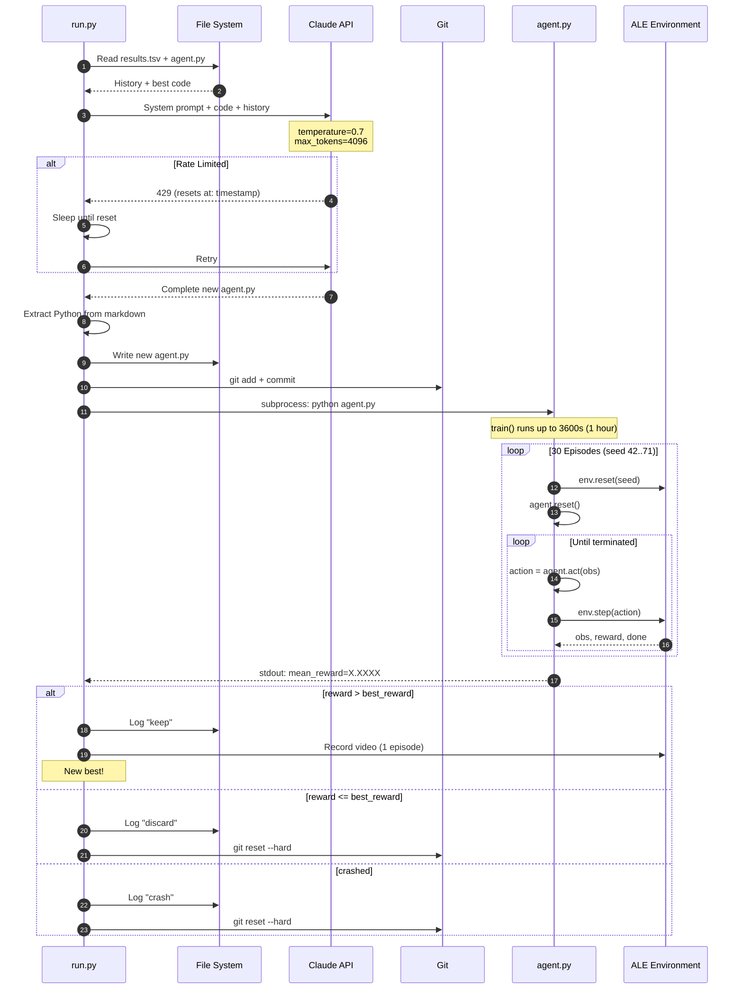

---

## 5. Experiment State Machine

Every possible state an experiment can be in, and every transition between them.

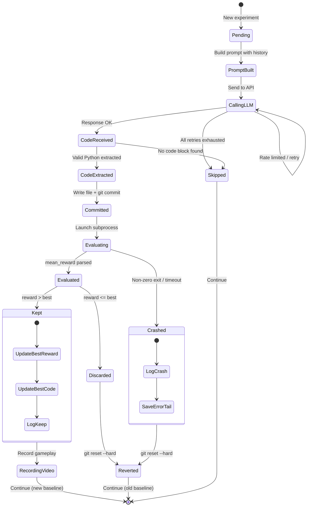

---

## 6. Developer Journey

What it feels like to use AutoResearch, from setup to results.

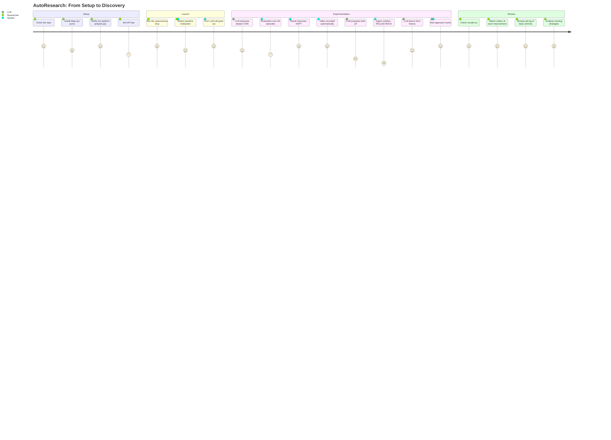

---

## 7. Agent Class Design

The full class hierarchy with all attributes, methods, and relationships.

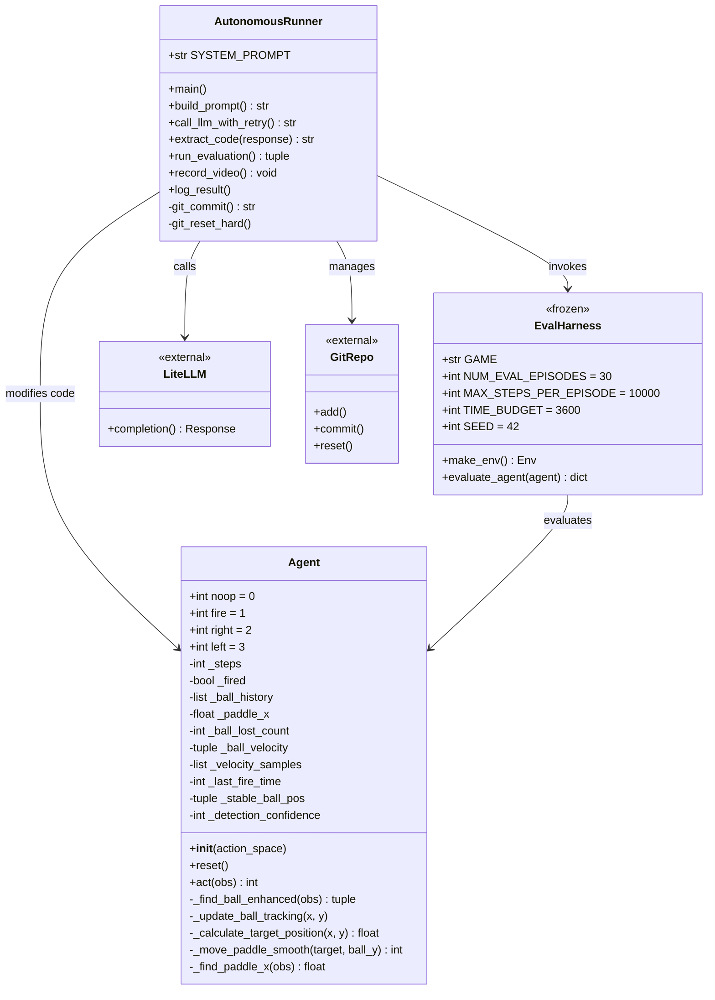

---

## 8. Observation Pipeline

How a raw 210x160 RGB frame becomes a paddle movement action.

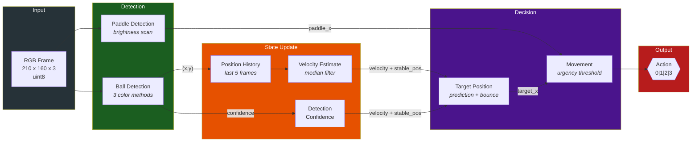

---

## 9. Ball Detection Algorithm

The multi-method detection in `_find_ball_enhanced()` — three parallel strategies merged into one result.

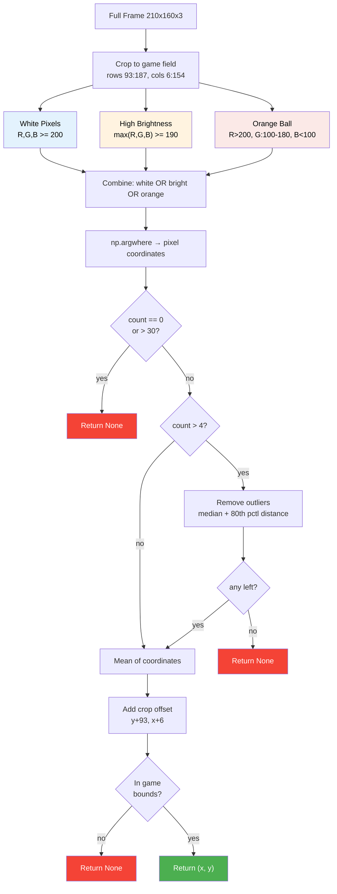

---

## 10. Trajectory Prediction

How `_calculate_target_position()` decides where the paddle should be.

```mermaid
flowchart TD
    START["ball_x, ball_y"] --> FAR{ball_y < 125?}

    FAR -->|"yes — ball far away"| SIMPLE["target = ball_x<br/><i>simple tracking</i>"]

    FAR -->|"no — ball in lower half"| HAS_VEL{velocity<br/>available?}

    HAS_VEL -->|"no"| HAS_HIST{history >= 2?}
    HAS_HIST -->|"no"| DIRECT["target = ball_x"]
    HAS_HIST -->|"yes"| ANTIC["target = ball_x + delta * 0.2-0.4"]

    HAS_VEL -->|"yes"| APPROACHING{vy > 0.1?}
    APPROACHING -->|"no"| HAS_HIST

    APPROACHING -->|"yes"| CALC["time = (189 - y) / vy<br/>predicted_x = x + vx * time"]
    CALC --> BOUNCE["Reflect off walls<br/>x=6 and x=154"]
    BOUNCE --> NEAR{ball_y > 165<br/>and |vx| > 0.5?}
    NEAR -->|"yes"| OFFSET["Strategic offset<br/>for angle control"]
    NEAR -->|"no"| CLAMP
    OFFSET --> CLAMP["Clamp to [10, 150]"]

    SIMPLE & DIRECT & ANTIC & CLAMP --> SMOOTH

    subgraph SMOOTH["_move_paddle_smooth()"]
        direction LR
        DIST["distance = target - paddle_x"]
        DIST --> URG{ball urgency}
        URG -->|"y>170"| T1["1px threshold"]
        URG -->|"y>150"| T2["2px threshold"]
        URG -->|"y>130"| T3["3.5px threshold"]
        URG -->|"y<=130"| T4["5px threshold"]
        T1 & T2 & T3 & T4 --> MOVE{|dist| > threshold?}
        MOVE -->|"no"| NOOP["NOOP"]
        MOVE -->|"yes, dist>0"| RIGHT["RIGHT"]
        MOVE -->|"yes, dist<0"| LEFT["LEFT"]
    end

    style NOOP fill:#607D8B,color:#fff
    style RIGHT fill:#2196F3,color:#fff
    style LEFT fill:#FF9800,color:#fff
```

---

## 11. Evaluation Harness

The immutable `evaluate_agent()` protocol — the ground truth metric.

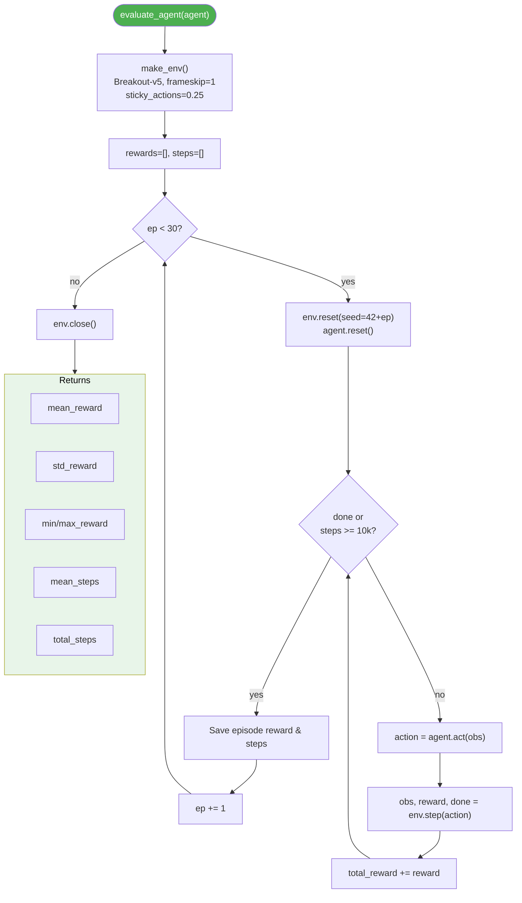

---

## 12. LLM Prompt Protocol

What gets sent to the LLM, and how the response is processed.

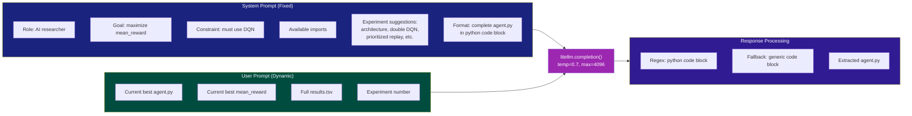

---

## 13. Git Branching Strategy

The main branch is a clean record of validated improvements. Failed experiments are erased.

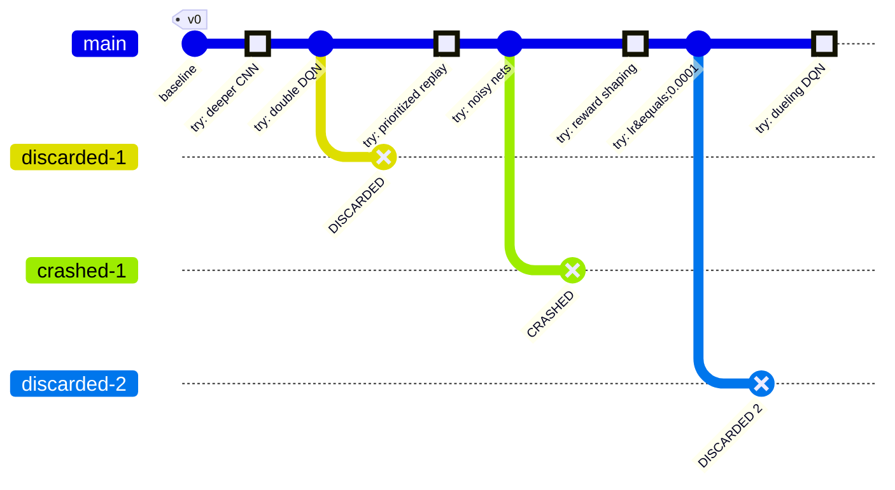

> **Key insight:** The main branch only contains improvements. `git log` reads like a scientific paper — each commit is a validated finding. Failed experiments exist only in `results.tsv`.

---

## 14. Experiment Timeline

How time is allocated during a single experiment cycle.

```mermaid
gantt
    title Single Experiment Timeline
    dateFormat X
    axisFormat %s

    section LLM
    Build prompt             :a1, 0, 5
    API call + response      :a2, 5, 30
    Extract code             :a3, 30, 32

    section Git
    Write + commit           :b1, 32, 34

    section Training
    agent train() up to 1hr  :crit, c1, 34, 3634

    section Evaluation
    Episodes 1-10            :d1, 3634, 3734
    Episodes 11-20           :d2, 3734, 3834
    Episodes 21-30           :d3, 3834, 3934

    section Video
    Record if kept           :v1, 3934, 3964

    section Decision
    Compare + log            :e1, 3964, 3968
    Keep or reset            :e2, 3968, 3970
```

---

## 15. Data Model

The entities and relationships in the system.

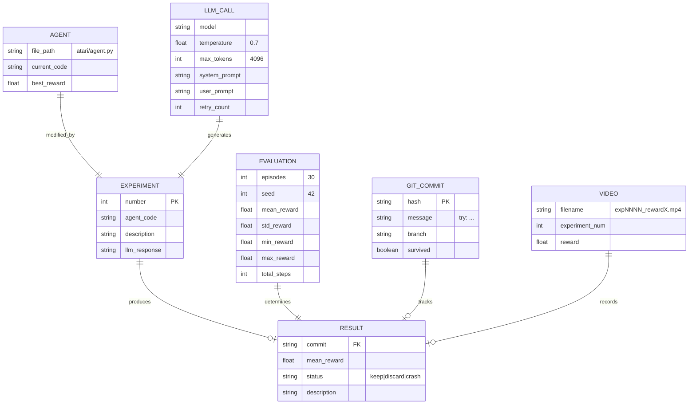

---

## 16. Action Space

Breakout's four actions and their approximate usage distribution during play.

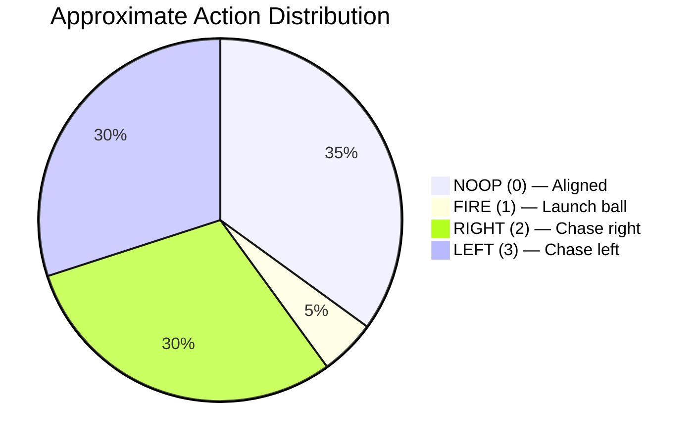

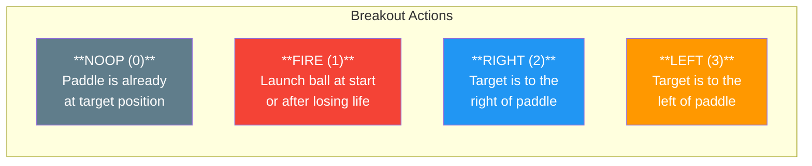

---

## 17. Error Handling & Recovery

Every failure mode the system can encounter, mapped to its recovery strategy.

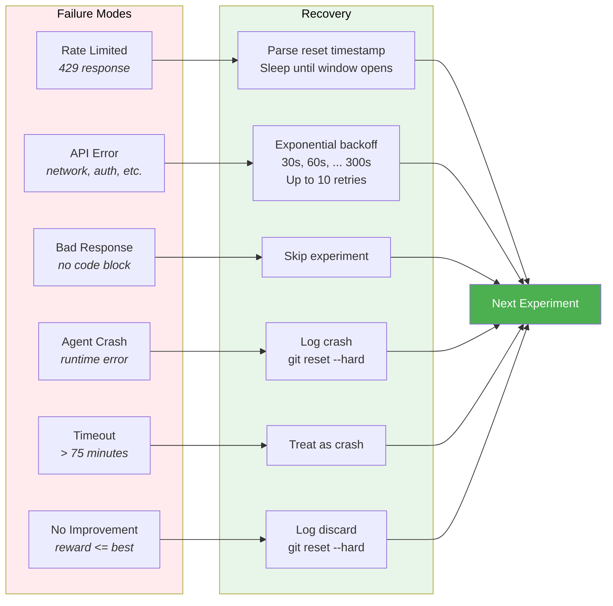

---

## 18. Dual-Track Comparison

The platform supports two research tracks with the same philosophy but different domains.

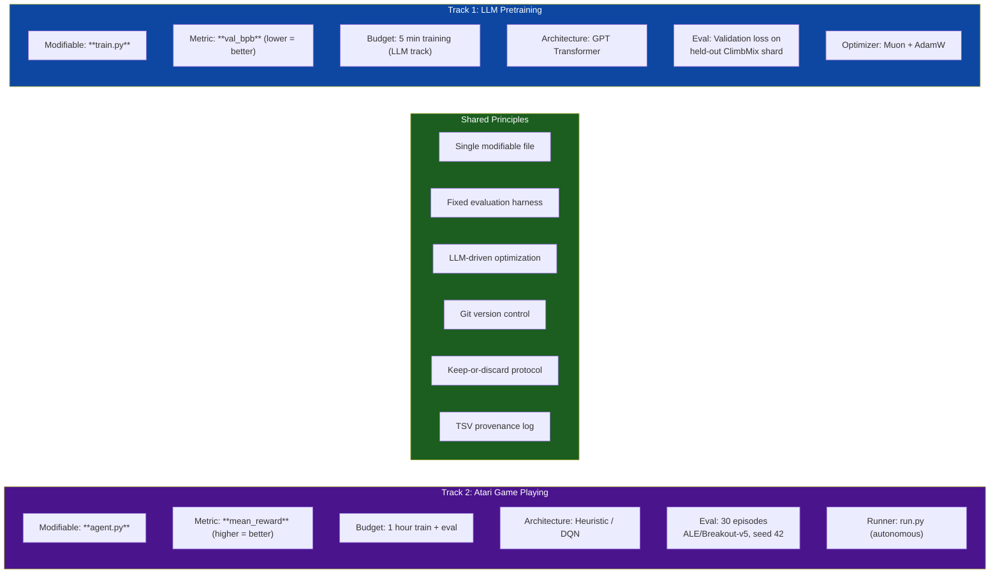

---

## 19. Dependency Graph

How all files and external packages connect.

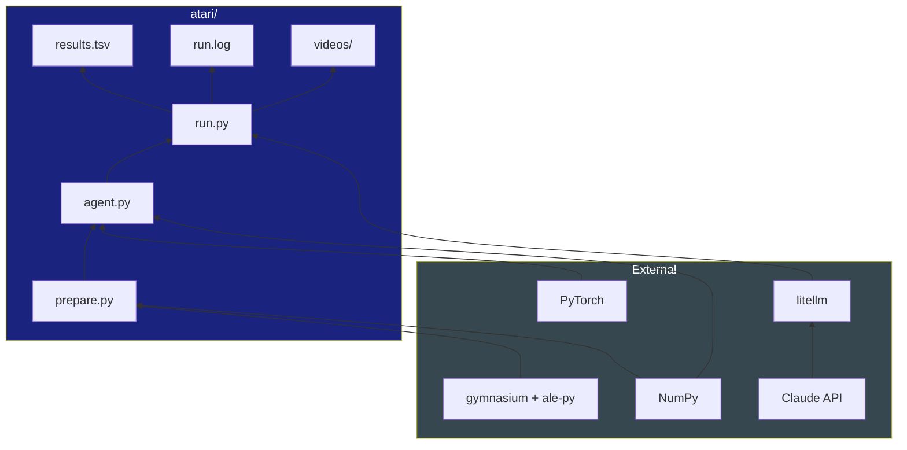

---

## 20. Outcome Space

A quadrant view of where experiments land based on execution success and reward.

```mermaid
quadrantChart
    title Experiment Outcome Space
    x-axis "Lower Reward" --> "Higher Reward"
    y-axis "Crashed" --> "Ran Successfully"
    quadrant-1 "KEEP"
    quadrant-2 "DISCARD"
    quadrant-3 "CRASH"
    quadrant-4 "CRASH"
    "Deeper CNN": [0.75, 0.9]
    "Double DQN": [0.85, 0.95]
    "Bad LR": [0.3, 0.85]
    "OOM": [0.1, 0.15]
    "Timeout": [0.2, 0.1]
    "Baseline": [0.5, 0.9]
    "Noisy nets": [0.45, 0.88]
    "Reward shaping": [0.7, 0.92]
    "Syntax error": [0.05, 0.05]
```

---

## Design Philosophy

This system encodes the scientific method into an automated loop:

| Principle | Implementation |
|-----------|----------------|
| **Hypothesis** | LLM proposes a code modification |
| **Experiment** | Fixed 30-episode evaluation with seeded environment |
| **Observation** | mean_reward compared to current best |
| **Conclusion** | Keep (publish) or discard (retract) |
| **Reproducibility** | Deterministic seeds, git history, TSV log |
| **Iteration** | Full history fed back into next hypothesis |

The result: **git log reads like a research paper** — each surviving commit is a validated improvement, and `results.tsv` is the lab notebook with every attempt documented.
